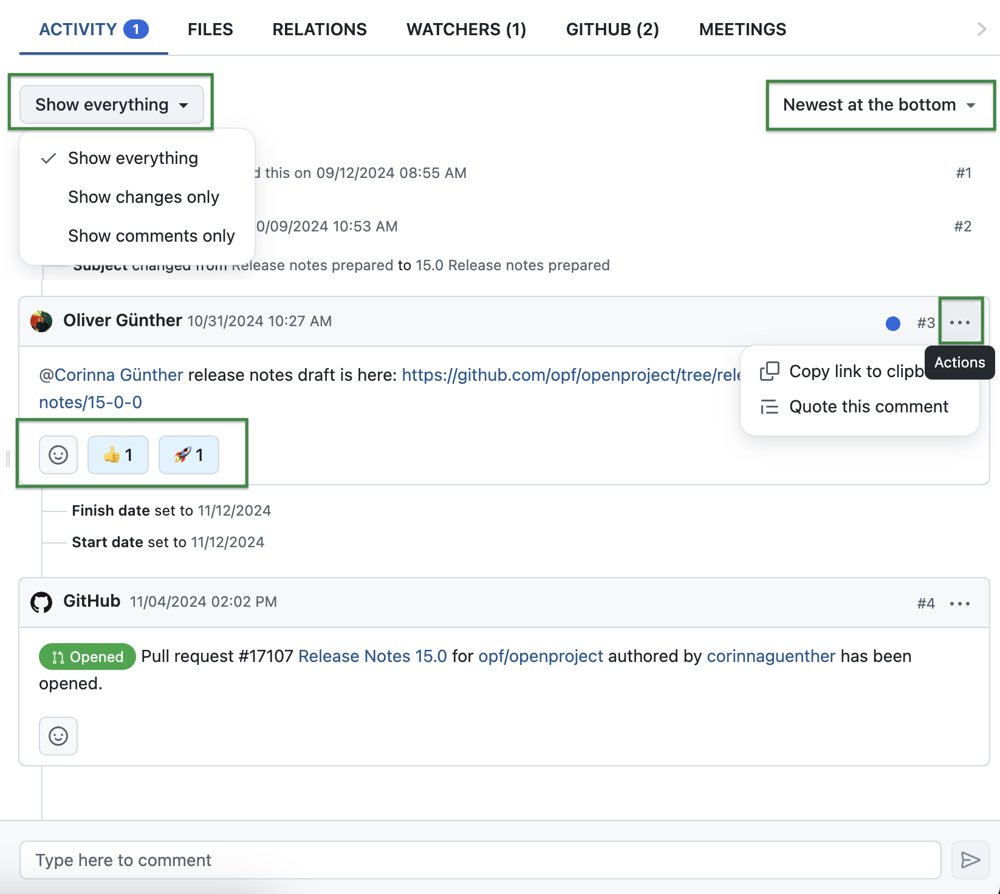
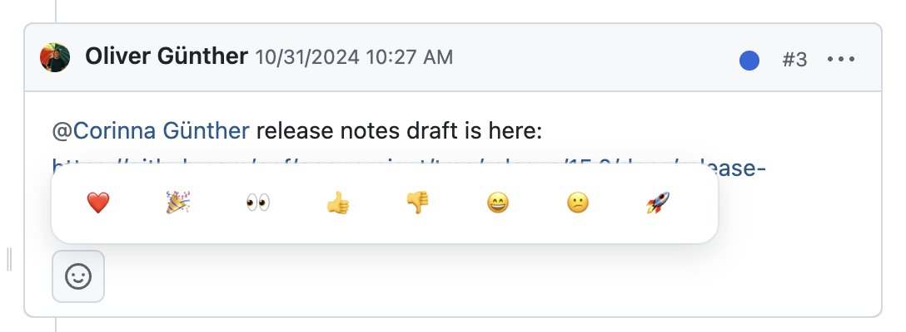
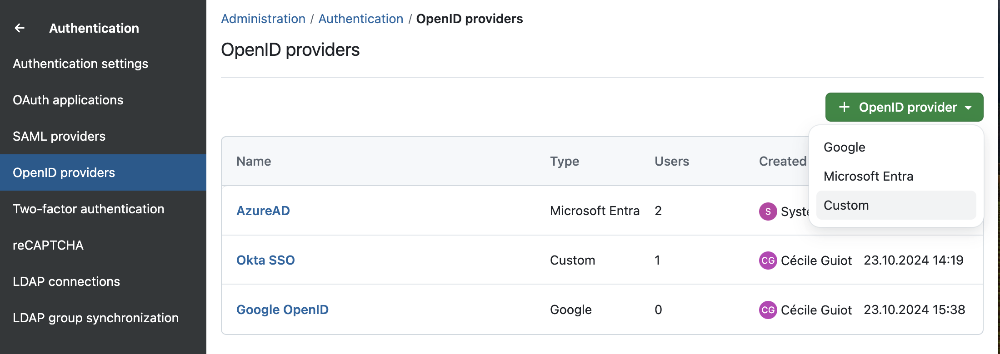
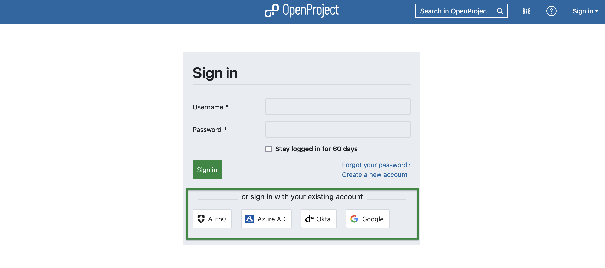
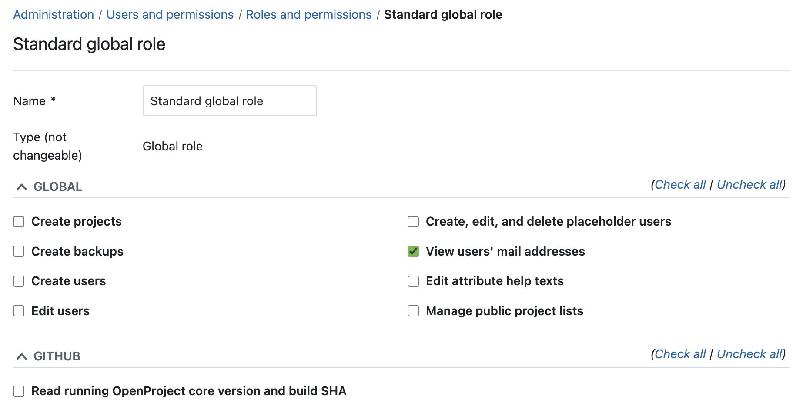
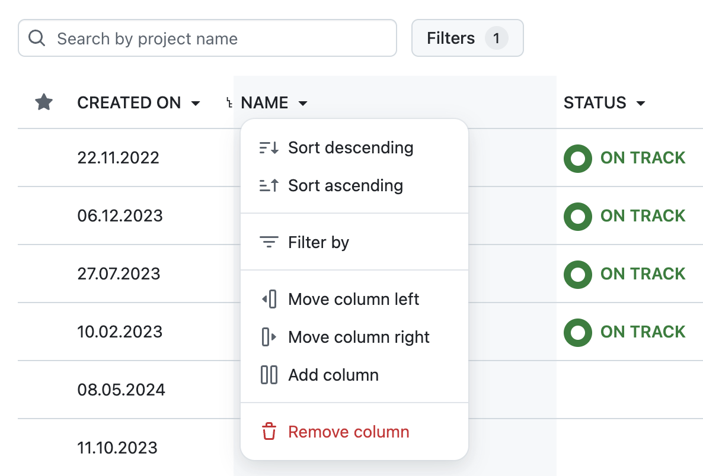

# OpenProject 15.0.0

Release date: 2024-11-13

We released [OpenProject 15.0.0](https://community.openproject.org/versions/2076). The major release contains several bug fixes and we recommend updating to the newest version. In these Release Notes, we will give an overview of important feature changes. At the end, you will find a complete list of all changes and bug fixes.

## Important feature changes

### Boost your communication with a better structured activity tab, real-time loading messages and notifications, emoji reactions, and more

A major change in version 15.0 is the overall look-and-feel of the activity tab of work packages. Users will notice that the activity tab has a new design with additional options, and that emoji reactions are now enabled. Additionally, new comments will appear directly without having to reload. This also applies to the notification center, where new notifications will appear in real-time.

This is a big bundle of new features that will greatly improve communication and interaction within OpenProject, making it more simple, more effective and more fun.

Related features in 15.0:
- [Change the design of the Activity panel to Primer](https://community.openproject.org/wp/54733)
- [Emoji reactions to work package comments](https://community.openproject.org/wp/40437)
- [Continuously update the notification center. Don't ask for loading updates.](https://community.openproject.org/wp/58253)
- [Remove "Latest activity" section from work package "Overview" tab](https://community.openproject.org/wp/58017)
- [On "Newest at the bottom" have the line touch the input box](https://community.openproject.org/wp/57262)

Let's take a closer look at the three biggest changes concerning this feature bundle:

#### A new timeline design for the activity tab of work packages

Apart from some obvious design changes that all fit GitHub's Primer design system, users will benefit from some great new features, such as: 
- The comment box being a fixed element anchored to the bottom of the split screen area.
- Filtering the activity panel with options to either show everything, changes only or comments only.
- Ordering to either newest on top or newest at the bottom

#### Emoji reactions to work package comments

Many users have wished to be able to react to comments in work packages using emoji and with OpenProject 15.0 this is now possible. In order to still keep it clear and concise, we have limited the emojis to eight helpful reactions:

Please note that emoji reactions don't trigger notifications. If you need your colleague to be notified about your reaction, leave a regular comment.

#### Continuous update of the notification center

Starting with version 15.0, the notification center will continuously update and new notifications will appear directly. This means no more blue flash message mentioning that there are updates and asking if you want to reload the page. The number shown next to the bell icon will also update immediately. This feature adds to our goal to enable smooth communication and information.

### Benefit from easy Single Sign-On authentication settings with SAML and OIDC in your administration

With OpenProject 15.0, particularly SaaS customers will benefit from our new user interface for SAML and OIDC. This means they can now set up integrations between OpenProject and SAML or OpenID connect stacks independently and offer users options for Single Sign-On (SSO). Before 15.0, SaaS customers had to contact the OpenProject support if they wanted custom integrations with their SAML or OpenID connect stacks. Now, they cannot only set them up on their own, but also have tools for debugging them if needed.

Related features in 15.0:

- [User interface for OIDC (OpenID Connect) provider configuration](https://community.openproject.org/wp/57677)
- [User interface for SAML configuration](https://community.openproject.org/wp/40279)
- [Show danger zone when deleting SAML or OIDC provider](https://community.openproject.org/wp/58451)
- [Allow setting omniauth_direct_login_provider through UI](https://community.openproject.org/wp/58437)

Under *Administration > Authentication*, admins can now set up [OpenID](../../system-admin-guide/authentication/openid-providers/) or [SAML providers](../../system-admin-guide/authentication/saml/). Here is an example screenshot for adding an OpenID provider:

Once set up, users can log in with their existing account, for example like shown in this screenshot:

### Use the new 'Standard global role' and enable permissions to view email addresses

With OpenProject 15.0, you get a new default 'Standard global role' that is automatically and permanently given to all users. If you are an administrator responsible for roles, please check this under *Administration > Users and permissions > Roles and permissions > Standard global role*. This role has several permissions to choose from, one being 'View users' mail addresses'.  Enable this permission to allow any user to see everyone's email address in autocomplete situations, such as when they select a work package assignee from a drop-down list.

Before version 15.0, users could choose whether their email address was displayed. Now this is an administrative decision that applies to either everyone or no one.

### Enjoy easier navigation in project lists with quick action table headers

With OpenProject 15.0, we are pleased to release another great feature for our project lists: Clicking on the table headers in a project list now gives you a quick action menu that not only allows you to sort in descending or ascending order, but also to filter or change, remove or add a column. While these features are not new and you can still find them in the top-right menu button, these actions are now much quicker to access.

### Experience simplified design settings with fewer sidebar design variables needed

Before version 15.0, the design configuration in the administration was very complex as there were many variables to be defined. This is why with OpenProject 15.0, the following design colors cannot be customized anymore:
- Header font
- Header font on hover
- Header border
- Main menu font
- Main menu font when selected
- Main menu font on hover
- Main menu border

All these colors will now be calculated depending on the brightness of the respective background to ensure a high-enough contrast. Font colors will either be black or white, and border colors will be set only if there is a bright background.

### Reduce manual cleanup when adding a custom field to a type – no more auto-applying to all projects

With OpenProject 14.6, we released a feature that allows you to enable or disable a custom field for multiple projects at once. This is why with OpenProject 15.0, we remove the automation to apply a new custom field to all projects where the respective type is activated. This reduces manual cleanup in case you did not want to activate the new custom field in all projects. If you do want that, you can use the feature we introduced last release and go to *Administration > Custom Fields* and click on the 'Add projects' button.

### Improved navigation clarity – 'My account' is renamed to 'Account settings'

In the personal menu that can be accessed by clicking on your avatar, we renamed 'My account' to 'Account settings', in order to give you a clearer understanding that this menu item contains settings. It now also differs more clearly from 'My Page' and 'My Activities‘, which provide personal data instead of settings.

## Important updates and breaking changes

<!-- Remove this section if empty, add to it in pull requests linking to tickets and provide information -->

<!--more-->

## Bug fixes and changes

<!-- Warning: Anything within the below lines will be automatically removed by the release script -->
<!-- BEGIN AUTOMATED SECTION -->

- Feature: User interface for SAML configuration \[[#40279](https://community.openproject.org/wp/40279)\]
- Feature: Emoji reactions to work package comments \[[#40437](https://community.openproject.org/wp/40437)\]
- Feature: Custom field no longer added to all projects when added to a type \[[#46309](https://community.openproject.org/wp/46309)\]
- Feature: Quick action table headers \[[#52147](https://community.openproject.org/wp/52147)\]
- Feature: Quick OAuth configuration flow for mobile app \[[#53620](https://community.openproject.org/wp/53620)\]
- Feature: Update PageHeaders &amp; SubHeaders in the (rails) global index pages \[[#53809](https://community.openproject.org/wp/53809)\]
- Feature: Primerise the Activity panel \[[#54733](https://community.openproject.org/wp/54733)\]
- Feature: Add separate permission to show email address in autocompleters \[[#56577](https://community.openproject.org/wp/56577)\]
- Feature: Reduce amount of design variables needed for the sidebar \[[#57153](https://community.openproject.org/wp/57153)\]
- Feature: On &quot;Newest at the bottom&quot; have the line touch the input box \[[#57262](https://community.openproject.org/wp/57262)\]
- Feature: Improve display of work package and agenda titles in meetings \[[#57671](https://community.openproject.org/wp/57671)\]
- Feature: User interface for OIDC (OpenID Connect) provider configuration \[[#57677](https://community.openproject.org/wp/57677)\]
- Feature: Rename &quot;My account&quot; to &quot;Account settings&quot; \[[#57685](https://community.openproject.org/wp/57685)\]
- Feature: Remove the &quot;Project details&quot; widget from Project overview \[[#57778](https://community.openproject.org/wp/57778)\]
- Feature: Create and edit custom field of type hierarchy \[[#57806](https://community.openproject.org/wp/57806)\]
- Feature: Remove &quot;Latest activity&quot; section from work package &quot;Overview&quot; tab \[[#58017](https://community.openproject.org/wp/58017)\]
- Feature: Remove link to full view from success flash message when saving a work package in other views \[[#58098](https://community.openproject.org/wp/58098)\]
- Feature: Add a caption to clarify what the % Complete field does in the Status settings page \[[#58147](https://community.openproject.org/wp/58147)\]
- Feature: Continuously update the notification center. Don&#39;t ask for loading updates. \[[#58253](https://community.openproject.org/wp/58253)\]
- Feature: Move &quot;Powered by CKEditor&quot; position to the left \[[#58294](https://community.openproject.org/wp/58294)\]
- Feature: Allow setting omniauth\_direct\_login\_provider through UI \[[#58437](https://community.openproject.org/wp/58437)\]
- Feature: Show danger zone when deleting SAML or OIDC provider \[[#58451](https://community.openproject.org/wp/58451)\]
- Feature: Remove &quot;Beta&quot; label from Dark mode selection \[[#58508](https://community.openproject.org/wp/58508)\]
- Feature: Primerised version of the basic work package hovercard \[[#58512](https://community.openproject.org/wp/58512)\]
- Feature: Move primary action to subheader \[[#58636](https://community.openproject.org/wp/58636)\]
- Bugfix: Work package date picker: wrong spacing \[[#47777](https://community.openproject.org/wp/47777)\]
- Bugfix: User is not taken to the secondary input field after selecting a filter \[[#53767](https://community.openproject.org/wp/53767)\]
- Bugfix: Creating project from template doesn&#39;t take over version filter correctly \[[#53978](https://community.openproject.org/wp/53978)\]
- Bugfix: \[mobile\] Scrolling within a modal scrolls the content underneath \[[#54109](https://community.openproject.org/wp/54109)\]
- Bugfix: Missing &quot;cause&quot; in WP journal when closing duplicates \[[#54372](https://community.openproject.org/wp/54372)\]
- Bugfix: The Assignee drop down list in the work packages list can&#39;t show long name perfectly. \[[#55870](https://community.openproject.org/wp/55870)\]
- Bugfix: Meeting timestamp in edit form not the same as in details \[[#56771](https://community.openproject.org/wp/56771)\]
- Bugfix: Transparent button of onboarding tour is sometimes hard to see \[[#56917](https://community.openproject.org/wp/56917)\]
- Bugfix: Mobile: tap twice on comment input to start typing \[[#57107](https://community.openproject.org/wp/57107)\]
- Bugfix: mention/comment made at the same time as work package modifications prevents mention notification email \[[#57251](https://community.openproject.org/wp/57251)\]
- Bugfix: Sorting by custom field has strong impact on performance for the project list \[[#57305](https://community.openproject.org/wp/57305)\]
- Bugfix: 500 error when opening a cost type with HTML in its name \[[#57333](https://community.openproject.org/wp/57333)\]
- Bugfix: Text barely readable because of hover effect when row is highlighted by status \[[#57412](https://community.openproject.org/wp/57412)\]
- Bugfix: Migration 20230608151123\_add\_validity\_period\_to\_journals is very slow \[[#57526](https://community.openproject.org/wp/57526)\]
- Bugfix: Custom field with format „Version“ are ordered as strings \[[#57550](https://community.openproject.org/wp/57550)\]
- Bugfix: Absent value for custom field is ordered not consistently at the beginning or end for different formats \[[#57554](https://community.openproject.org/wp/57554)\]
- Bugfix: Broken ordering by multi value custom fields \[[#57577](https://community.openproject.org/wp/57577)\]
- Bugfix: Empty string is selectable in the time zone selection drop-down \[[#57667](https://community.openproject.org/wp/57667)\]
- Bugfix: Insufficient spacing on Captcha modal \[[#57804](https://community.openproject.org/wp/57804)\]
- Bugfix: Broken link to the documentation in open storage modal after timeout. \[[#57896](https://community.openproject.org/wp/57896)\]
- Bugfix: Topbar search input text color is too dark when unfocused \[[#57950](https://community.openproject.org/wp/57950)\]
- Bugfix: Gantt chart PDF export ignores manuall sorting \[[#57960](https://community.openproject.org/wp/57960)\]
- Bugfix: The Activity entry for creation is lacking the info that it is a &quot;Creation&quot;. \[[#57968](https://community.openproject.org/wp/57968)\]
- Bugfix: Number of listed Work Packages limited to 20 only w/o button of page number for switching \[[#57977](https://community.openproject.org/wp/57977)\]
- Bugfix: Fix AMPF &quot;Health status&quot; error messages capitalisation \[[#58016](https://community.openproject.org/wp/58016)\]
- Bugfix: User tab headers overlap when header text is long \[[#58106](https://community.openproject.org/wp/58106)\]
- Bugfix: Dark mode: &quot;Custom text&quot; widget - table cell editing UI has wrong colors \[[#58108](https://community.openproject.org/wp/58108)\]
- Bugfix: Self notification doesn&#39;t trigger a notifcation and mail \[[#58151](https://community.openproject.org/wp/58151)\]
- Bugfix: Unnecessary space to the right on certain view width \[[#58237](https://community.openproject.org/wp/58237)\]
- Bugfix: Access token refresh results in error message in files tab \[[#58271](https://community.openproject.org/wp/58271)\]
- Bugfix: Improve sidebar item alignment \[[#58280](https://community.openproject.org/wp/58280)\]
- Bugfix: Work package description disappears after changing a text field \[[#58286](https://community.openproject.org/wp/58286)\]
- Bugfix: Notification center work package view (split-screen) has redundant buttons on mobile \[[#58296](https://community.openproject.org/wp/58296)\]
- Bugfix: Inserted images are lost when the &#39;Show attachments in the work packages files tab&#39; is OFF \[[#58337](https://community.openproject.org/wp/58337)\]
- Bugfix: My page is empty if user has no permissions \[[#58341](https://community.openproject.org/wp/58341)\]
- Bugfix: Update-Warning is not readable in dark mode \[[#58359](https://community.openproject.org/wp/58359)\]
- Bugfix: Sorting custom actions by &quot;sort&quot; header produces 500 \[[#58361](https://community.openproject.org/wp/58361)\]
- Bugfix: Creating project from template doesn&#39;t take over version column correctly \[[#58388](https://community.openproject.org/wp/58388)\]
- Bugfix: Meetings modules is not showing the sidebar selection in the PageHeader \[[#58393](https://community.openproject.org/wp/58393)\]
- Bugfix: Enterprise banners have excessive top-margin \[[#58404](https://community.openproject.org/wp/58404)\]
- Bugfix: Enterprise banner is not shown on &quot;new board&quot; page \[[#58411](https://community.openproject.org/wp/58411)\]
- Bugfix: When you click on the &quot;To the Notification Center&quot; button, an outline appears \[[#58414](https://community.openproject.org/wp/58414)\]
- Bugfix: Time &amp; Costs Delete button is green \[[#58419](https://community.openproject.org/wp/58419)\]
- Bugfix: Notification screen does not show submenu headers in the breadcrumb \[[#58420](https://community.openproject.org/wp/58420)\]
- Bugfix: Sidebar menu should be hidden when page width is reduced \[[#58454](https://community.openproject.org/wp/58454)\]
- Bugfix: Info box on new custom field of type hierarchy is permanent \[[#58466](https://community.openproject.org/wp/58466)\]
- Bugfix: Item add form disappears after added a new item to a custom field of type hierarchy \[[#58467](https://community.openproject.org/wp/58467)\]
- Bugfix: Rename &quot;Enabled in projects&quot; to &quot;Projects&quot; tab &quot;Projects&quot; \[[#58479](https://community.openproject.org/wp/58479)\]
- Bugfix: Calendar shortcut link broken \[[#58527](https://community.openproject.org/wp/58527)\]
- Bugfix: Improve error handling when two users edit the same work package in parallel (conflict) \[[#58634](https://community.openproject.org/wp/58634)\]
- Bugfix: Using multi-select and required options do not work \[[#58635](https://community.openproject.org/wp/58635)\]
- Bugfix: Slow project template selector on new project page \[[#58657](https://community.openproject.org/wp/58657)\]
- Bugfix: Admin info &quot;bug&quot; icon is misleading \[[#58671](https://community.openproject.org/wp/58671)\]
- Bugfix: Performance issues on work\_packages api endpoint \[[#58689](https://community.openproject.org/wp/58689)\]
- Feature: Create and share custom project lists with new filter options \[[#49687](https://community.openproject.org/wp/49687)\]
- Feature: Work package Activity tab update: Timeline UI, instant updates, Emoji reactions \[[#56865](https://community.openproject.org/wp/56865)\]

<!-- END AUTOMATED SECTION -->
<!-- Warning: Anything above this line will be automatically removed by the release script -->

## Contributions

A very special thank you goes to the City of Cologne for sponsoring parts of this release. Also a big thanks to our Community members for reporting bugs and helping us identify and provide fixes. Special thanks for reporting and finding bugs go to Bill Bai, Sam Yelman, Ivan Kuchin, Knight Chang, Gábor Alexovics, Gregor Buergisser, Andrey Dermeyko, Various Interactive, Clayton Belcher, Александр Татаринцев, and Keno Krewer.

Last but not least, we are very grateful for our very engaged translation contributors on Crowdin, who translated quite a few OpenProject strings! This release we would like to highlight
- [Alexander Aleschenko](https://crowdin.com/profile/top4ek), for a great number of translations into Russian.
- [hmmftg](https://crowdin.com/profile/hmmftg), for a great number of translations into Persian.
- [william](https://crowdin.com/profile/WilliamFromTW), for a great number of translations into Chinese Simplified and Chinese Traditional.
- [Alin Marcu](https://crowdin.com/profile/deconfcom), for a great number of translations into Romanian.

Would you like to help out with translations yourself? Then take a look at our [translation guide](../../development/translate-openproject/) and find out exactly how you can contribute. It is very much appreciated!